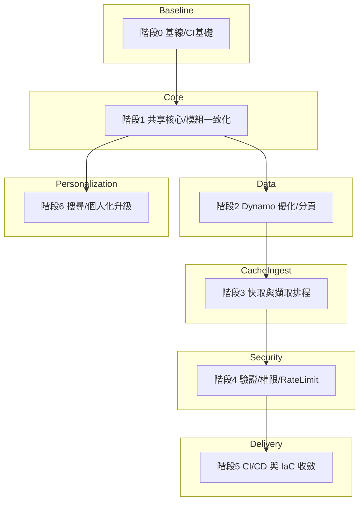

# NewsFlow 架構改善計畫（含相依性與迭代效率）

本文件規劃以「最小風險、最快回饋」為原則的分階段改善路線。每一階段包含目標、步驟（具先後順序）、相依性、產出（DoD）、對未來迭代速度的助益、風險與回滾策略。

---

## 階段 0：基線盤點與守門人（1 天）
- 目標：建立一致的工作基線，避免後續變更引發漂移。
- 步驟（順序）
  1. 建立 `docs/` 與本文件（完成）
  2. 新增 `.env.example`（root 與 `mobile/`），列出 `OPENAI_API_KEY`、`EXPO_PUBLIC_API_BASE_URL`、AWS 相關設定
  3. 清理 `.gitignore`：加入打包產物（例如 `current-lambda.zip`、暫存、coverage 等）
  4. 加上簡單的 Lint 與 TypeCheck 流程（GitHub Actions：`lint`/`typecheck`）
- 相依性：無（可立即執行）
- 產出（DoD）：
  - `.env.example` 存在且可用
  - `.gitignore` 防止大型產物入庫
  - CI 能跑 Lint/TypeCheck
- 對迭代速度的幫助：新人上手更快、避免雜訊 PR、基本品質閘門
- 風險與回滾：低風險；如影響 CI，臨時停用工作流程檔並修正

---

## 階段 1：邏輯收斂（Shared Core）與模組一致化（2–3 天）
- 目標：消除 Express 與 Lambda 的重複商業邏輯，防止行為漂移；統一 ESM 模組系統。
- 步驟（順序）
  1. 建立 `shared/engine/`（新目錄）
     - 將「取新聞、個人化、搜尋、使用者偏好更新」抽成純函式與資料存取介面（ports）
  2. 實作資料層 adapter（Dynamo）：`shared/adapters/dynamo/`
  3. Express 端改為薄介面：`api/routes/*` 僅負責路由/驗證/序列化，呼叫 `shared/engine`
  4. Lambda 端改為薄介面：`lambda/*` 呼叫 `shared/engine`
  5. 移除或標記過時檔案：`newsApi-dynamo.js`（改 ESM 或淘汰）
- 相依性：階段 0 完成（CI/基線）
- 產出（DoD）：
  - `shared/engine` 被 Express 與 Lambda 共同引用
  - `api/`、`lambda/` 僅保留薄介面層
  - 專案全域使用 ESM（`type: module` 一致）
- 對迭代速度的幫助：單一邏輯來源，功能改一次、兩端生效；降低維護成本
- 風險與回滾：
  - 風險：路由對齊與回傳格式差異
  - 回滾：保留舊版本分支；以路由旗標逐步切換流量

---

## 階段 2：DynamoDB 存取優化（Query + GSI + 分頁）（2–4 天）
- 目標：用 Query 取代 Scan、導入 GSI 與分頁，提高效能與成本效率。
- 步驟（順序）
  1. 設計資料模型與 GSI（以 IaC 管理，優先 Amplify）：
     - GSI1：`publishedAt`（最新排序）
     - GSI2：`source` / `category`（可選，看查詢需求）
  2. 實作分頁：API 回傳 `items` + `nextToken`（來自 `LastEvaluatedKey`）
  3. `shared/adapters/dynamo` 改寫為 Query 流程；保留暫時兼容模式（若無 GSI 時退回有限 Scan）
  4. 調整 `api/` 與 `lambda/` 的參數驗證與回應格式
  5. 壓力測試與成本估算（Dynamo 設定 RCU/WCU 或 On-Demand）
- 相依性：階段 1 的共享核心
- 產出（DoD）：
  - 查新聞路徑不再使用 Scan（或僅作為 fallback）
  - 提供穩定的分頁協定
- 對迭代速度的幫助：能快速擴增列表/搜尋功能，不必擔心全表掃描
- 風險與回滾：
  - 風險：GSI 建立與資料重建時間
  - 回滾：保留舊索引與掃描路徑，流量灰度切換

---

## 階段 3：快取策略與擷取流程（2–4 天）
- 目標：降低讀取延遲與熱點；RSS 擷取改為排程、冪等且可重試。
- 步驟（順序）
  1. 選擇快取策略：
     - Serverful：Redis/ElastiCache
     - Serverless：API Gateway Cache 或 DAX（先選 API GW Cache 作最小變更）
  2. 在 `shared/engine` 提供可選快取層（decorator pattern），失效策略：時間/事件
  3. 將 `api/services/rssIngestor.js` 抽離為獨立 Lambda（`ingestion-lambda`），由 EventBridge 定時觸發
  4. 擷取流程加上：重試/退避、去重、冪等寫入、批次摘要欄位（`structuredSummary`）
- 相依性：階段 1（共享核心），部分依賴階段 2 的資料欄位
- 產出（DoD）：
  - 熱門 `GET` 有命中率可觀的快取（至少 50%+）
  - 擷取由排程觸發，線上查詢無阻塞
- 對迭代速度的幫助：線上讀更快、容錯高，新功能上線不易衝擊
- 風險與回滾：
  - 風險：快取不一致、過期策略錯誤
  - 回滾：關閉快取層或回退至僅資料庫直讀

---

## 階段 4：驗證、權限與安全性（1–3 天）
- 目標：強化輸入驗證、Rate Limit、AuthN/Z，避免濫用與資料外洩。
- 步驟（順序）
  1. 在薄介面層導入參數驗證（如 `zod`）：`limit`、`q`、`userId` 等
  2. Express 加上 `express-rate-limit`；API Gateway 設置節流（burst/steady）
  3. 串 Cognito（或既有身分系統），`/user/{userId}` 僅允許本人存取；以中介層注入 `sub`
  4. 日誌結構化（加 requestId/路由/延遲），統一錯誤格式
- 相依性：階段 1 完成；Cognito/Amplify 設定
- 產出（DoD）：
  - 重要路由都具驗證與節流
  - 敏感操作已綁定身份
- 對迭代速度的幫助：減少事故與告警時間，開發者能專注功能
- 風險與回滾：
  - 風險：權限設定導致誤封流量
  - 回滾：以環境變數關閉強制驗證或降低門檻

---

## 階段 5：CI/CD 與 IaC 收斂（2–3 天）
- 目標：單一來源管理（Amplify 或同級 IaC），自動化測試/部署，避免腳本與 IaC 混用漂移。
- 步驟（順序）
  1. 決策 IaC 主方案（建議：沿用 Amplify，集中管理 API Gateway/Lambda/Dynamo/GSI/環境變數）
  2. GitHub Actions：
     - PR：Lint/TypeCheck/Test
     - main：部署 dev 環境；打 tag 觸發 prod
  3. 淘汰手動 `zip` 與散落腳本（`create/update/deploy-*`），改成 IaC 驅動
- 相依性：前述各階段的資源宣告
- 產出（DoD）：
  - 基礎設施以 IaC 版本化
  - 部署全自動化且可重現
- 對迭代速度的幫助：縮短交付時間、降低人為錯誤
- 風險與回滾：
  - 風險：IaC 調整造成資源替換
  - 回滾：以變更集（ChangeSet）與多環境驗證

---

## 階段 6：搜尋與個人化升級（可並行，3–7 天，視範圍）
- 目標：提升搜尋與推薦效果，支援 A/B 實驗。
- 步驟（範例，依優先順序）
  1. 將關鍵字比對改為斷詞與簡易權重；或導入 embeddings 做語意搜尋
  2. 個人化引擎支援權重與 decay（時間衰退）
  3. 導入 Feature Flag（A/B Test）以驗證成效
- 相依性：共享核心已就緒
- 產出（DoD）：
  - 可切換策略與量測效果
- 對迭代速度的幫助：能安全試驗、快速收斂
- 風險與回滾：
  - 風險：新策略不如舊策略
  - 回滾：旗標切回舊策略

---

## 里程碑與時程粗估
- 里程碑 M0：基線穩定（階段 0）— 1 天
- 里程碑 M1：共享核心落地（階段 1）— 2–3 天
- 里程碑 M2：Dynamo 優化 + 分頁（階段 2）— 2–4 天
- 里程碑 M3：快取 + 擷取排程（階段 3）— 2–4 天
- 里程碑 M4：安全性與驗證（階段 4）— 1–3 天
- 里程碑 M5：CI/CD + IaC（階段 5）— 2–3 天
- 里程碑 M6：搜尋/個人化升級（階段 6）— 3–7 天

> 實際天數依人力與現況差異微調；里程碑之間可採灰度釋出以降低風險。

---

## 對未來開發迭代速度的整體影響
- **單一邏輯來源（Shared Core）**：一次修改、兩端（Express/Lambda）同步受益
- **資料存取最佳化**：穩定分頁協定 + Query/GSI，開發清單/搜尋等功能更快
- **快取 + 排程擷取**：降低線上延遲，避免擷取干擾讀取
- **驗證/權限/可觀測性**：降低事故與除錯時間，PR 更可預期
- **IaC/CI**：可重現部署、縮短交付週期，降低環境漂移

---

## 追蹤與量測建議（每階段）
- **效能**：P95 延遲、Dynamo 調用次數/耗用、快取命中率
- **可靠度**：錯誤率、重試次數、告警數
- **交付速度**：PR 從開到併的 lead time、deploy 頻率
- **功能成效**：點擊率、留存、喜歡/略過比率（依產品指標）

---

## 附錄：任務分組與相依性圖（簡版）

